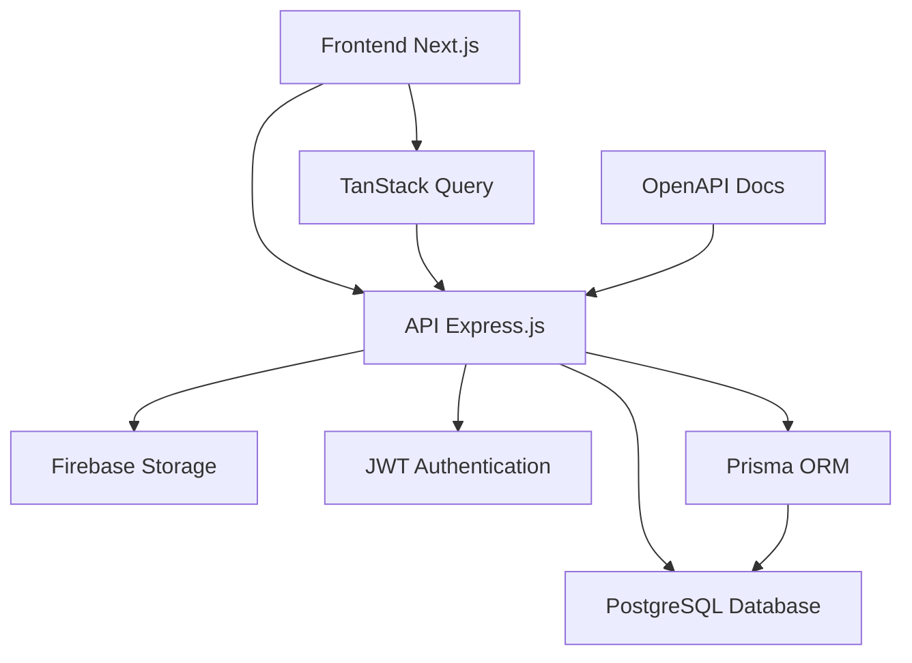

# 🌐 RedeCT - Rede de Ciência e Tecnologia

<div align="center">


**Uma rede independente que conecta pesquisadores, povos tradicionais e a academia**

[](https://nextjs.org/)
[](https://www.typescriptlang.org/)
[](https://reactjs.org/)
[](https://nodejs.org/)
[](https://www.postgresql.org/)
[](https://www.prisma.io/)
[](https://tailwindcss.com/)
[](https://firebase.google.com/)

[](CONTRIBUTING.md)
[](https://github.com/seu-usuario/rede-ct/issues)

</div>

## 📋 Índice

- [🎯 Sobre o Projeto](#-sobre-o-projeto)
- [🚀 Funcionalidades](#-funcionalidades)
- [🛠 Tecnologias](#-tecnologias)
- [🏗 Arquitetura](#-arquitetura)
- [🚀 Instalação](#-instalação)
- [⚙️ Configuração](#️-configuração)
- [🎮 Uso](#-uso)
- [📄 Licença](#-licença)

## 🎯 Sobre o Projeto

A **RedeCT** é uma rede independente que reúne pesquisadores, professores, estudantes, povos tradicionais e demais interessados que atuam acadêmica e cientificamente em colaboração com os Povos Tradicionais (indígenas, quilombolas, caiçaras, ribeirinhos, povos de terreiro, faxinalenses, geraizeiros, pantaneiros, quebradeiras de coco babaçu, dentre outros).

### 🎯 Missão

Contribuir para a melhoria contínua das produções científicas e das relações entre a academia e os povos tradicionais, promovendo a convergência entre conhecimento acadêmico e saberes tradicionais.

### 🌟 Principais Características

- **🌍 Rede Internacional**: Conecta pesquisadores de diversos países
- **🤝 Colaboração Acadêmica**: Promove parcerias entre universidades e comunidades tradicionais
- **📚 Publicações Científicas**: Mantém coletâneas anuais de trabalhos científicos
- **🎪 Eventos Científicos**: Organiza congressos e webinários permanentes
- **👥 Gestão de Equipes**: Sistema completo de gestão de equipes de pesquisa
- **🏆 Certificações**: Controle de certificados e pendências
- **📊 Dashboard Administrativo**: Painel completo para gestão da rede
- **🔐 Sistema de Autenticação**: Controle de acesso seguro

## 🚀 Funcionalidades

### 🌐 Área Pública

#### 🏠 Homepage
- Timeline histórica interativa da RedeCT
- Apresentação institucional
- Destaques e notícias recentes

#### 👥 Quem Somos
- **Apresentação e História**: Linha do tempo, missão, valores e objetivos
- **Equipe de Gestão**: Membros da equipe de gestão da rede
- **Pesquisadores Participantes**: Diretório completo com filtros por senioridade
- **Eixos Temáticos Permanentes (ETPs)**: Gestão e visualização de ETPs
- **Instituto de Pesquisas Amazônicas e de Povos Tradicionais**: Informações institucionais
- **Parceiros e Financiadores**: Lista de parceiros e apoiadores
- **Regimentos**: Acesso aos regimentos da rede
- **Reuniões e Atas**: Histórico de reuniões com atas
- **Transparência e Controle Social**: Demonstrativos financeiros, contas correntes e extratos

#### 📰 Notícias
- Sistema completo de notícias com paginação
- Visualização individual de notícias
- Filtros e busca

#### 💼 Portfólio
- **Centro de Referência UNESP**: Informações sobre o centro
- **Destaques da RedeCT**: Membros e instituições homenageadas
- **Grupos de Pesquisa**: Cadastro e visualização de grupos
- **Legislações**: Banco de legislações relevantes
- **Museus**: Diretório de museus parceiros

#### 📚 Publicações
- **Livros da RedeCT**: Volumes publicados pela rede
- **Artigos Científicos**: Repositório de artigos
- **Periódicos e Revistas Parceiras**: Revistas científicas parceiras

#### 🎓 Divisão Científica
- **Congressos**: Científicos Internacionais e Regionais com galerias
- **Webinário Permanente**: Programação e arquivo de webinários
- **Cursos**: Cursos oferecidos pela rede
- **Pós-Graduação**: Programas de pós-graduação
- **Calendário de Eventos**: Eventos científicos com filtros
- **Selo de Qualidade em Extensão Universitária**: Informações sobre o selo

#### 👤 Perfil Público
- Visualização de perfil de usuários e pesquisadores

#### 🔐 Autenticação
- **Sign In**: Login de usuários
- **Sign Up**: Cadastro de novos usuários

#### 🛍️ Lojas e Oportunidades
- Área dedicada a oportunidades e parcerias

---

### 🔐 Área Restrita (Admin)

#### 📊 Dashboard
- Painel administrativo com métricas gerais
- Resumo de atividades e estatísticas

#### � Gestão de Usuários
- Cadastro, edição e exclusão de usuários
- Promoção e rebaixamento de permissões
- Controle de roles (Admin/User)
- Visualização de perfis completos

#### 📝 Gestão de Notícias
- Criação de notícias com editor rico (Tiptap)
- Edição e exclusão de notícias
- Upload de imagens para notícias
- Gestão completa de conteúdo

#### 🎓 Gestão de Congressos
- **Congressos Científicos Internacionais**: CRUD completo
- **Congressos Regionais**: CRUD completo
- **Galerias**: Upload e gestão de imagens de congressos
- **Parceiros de Congressos**: Gestão de parceiros por congresso
- Documentos: editais, programações, anais, relatórios

#### 📚 Gestão de Cursos e Programas
- **Cursos**: Criação e gestão de cursos
- **Programas de Pós-Graduação**: CRUD de programas
- Coordenadores e instrutores
- Links de inscrição e materiais

#### 👥 Gestão de Equipes
- **Equipe de Gestão**: Membros e funções
- **Comitê Legitimador**: Gestão de membros
- **Equipe SDHC**: Sustentabilidade e Desenvolvimento
- **Grupo de Trabalho**: Gestão de GT
- **Centro de Referência UNESP**: Equipe do centro

#### 🔬 Gestão de Pesquisadores
- Cadastro completo de pesquisadores
- Senioridade, formação e ocupações
- ORCID e Lattes
- Biografias e instituições
- Vinculação a ETPs

#### 🎯 Gestão de ETPs
- Criação e edição de Eixos Temáticos Permanentes
- Designação de líderes, vice-líderes e secretários
- Gestão de membros
- Códigos e descrições

#### � Gestão de Eventos
- Criação de eventos (online/presencial)
- Status: pendente, finalizado, cancelado
- Links e localizações
- Calendário integrado

#### 🎬 Gestão de Webinários
- Programação de webinários
- Upload de thumbnails
- Convidados e links
- Arquivo de webinários anteriores

#### 📄 Gestão de Documentos
- **Certificações**: Upload e gestão de certificados
- **Pendências**: Controle de pendências com documentos
- **Regimentos**: Versões e status de regimentos
- **Reuniões e Atas**: Atas de reuniões

#### 🏆 Gestão Institucional
- **Destaques da RedeCT**: Homenagens e menções honrosas
- **In Memoriam**: Registro de homenageados falecidos
- **Parceiros e Financiadores**: Gestão de parceiros
- **Grupos de Pesquisa**: CRUD de grupos
- **Legislações**: Banco de leis
- **Museus**: Diretório de museus

#### 💰 Gestão Financeira
- **Contas Correntes**: Gestão de contas (RedeCT, Eventos, Colóquios)
- **Extratos de Transações**: Upload e controle de extratos
- Saldos e movimentações

#### 📚 Gestão de Publicações
- **Livros da RedeCT**: Volumes com capas e fichas catalográficas
- **Artigos Científicos**: Repositório completo
- **Revistas Científicas**: Parceiras e dados editoriais

#### 📈 Histórico de Contribuições
- Acompanhamento detalhado de atividades
- Logs de contribuições por usuário

#### ⚙️ Perfil do Usuário
- Edição de dados pessoais
- Upload de avatar
- Atualização de ORCID e Lattes
- Alteração de senha


## 🛠 Tecnologias

### 🎨 Frontend
| Tecnologia | Versão | Descrição |
|------------|--------|-----------|
| **Next.js** | 16.1.0 | Framework React com App Router, Server Components e Turbopack |
| **React** | 19.2.3 | Biblioteca de interface de usuário com React Compiler |
| **TypeScript** | 5.0+ | Tipagem estática para JavaScript |
| **Tailwind CSS** | 4.1.18 | Framework de CSS utilitário |
| **Radix UI** | 1.4.3 | Componentes acessíveis e customizáveis |
| **Tiptap** | 3.14.0 | Editor de texto rico WYSIWYG |
| **React Hook Form** | 7.68.0 | Gerenciamento de formulários performático |
| **TanStack Query** | 5.90.12 | Gerenciamento de estado do servidor |
| **TanStack Table** | 8.21.3 | Tabelas avançadas e interativas |
| **Lucide React** | 0.561.0 | Biblioteca de ícones |
| **Motion** | 12.23.26 | Animações e transições |
| **Zod** | 4.1.13 | Validação de schemas |

### ⚙️ Backend
| Tecnologia | Versão | Descrição |
|------------|--------|-----------|
| **Node.js** | 18+ | Runtime JavaScript |
| **Express.js** | 5.2.1 | Framework web minimalista |
| **TypeScript** | 5.9.3 | Tipagem estática |
| **Prisma** | 7.1.0 | ORM moderno para banco de dados |
| **PostgreSQL** | 17 | Banco de dados relacional |
| **JWT** | 9.0.3 | Autenticação baseada em tokens |
| **Bcrypt** | 3.0.3 | Criptografia de senhas |
| **Multer** | 2.0.2 | Upload de arquivos |
| **Firebase Admin** | 13.6.0 | Armazenamento de arquivos |
| **Sharp** | 0.34.5 | Processamento de imagens (WebP) |
| **CORS** | 2.8.5 | Cross-Origin Resource Sharing |

### 🔧 DevOps & Ferramentas
| Tecnologia | Descrição |
|------------|-----------|
| **Docker** | Containerização da aplicação |
| **Vercel** | Deploy automático do frontend |
| **Biome** | Linter e formatter moderno |
| **OpenAPI/Swagger** | Documentação interativa da API |
| **Prisma Studio** | Interface visual para o banco |
| **TSUP** | Bundler rápido para TypeScript |

## 🏗 Arquitetura

O projeto segue uma arquitetura de **monorepo** com duas aplicações principais:

```
rede-ct/
├── rede-ct/                    # Frontend (Next.js)
│   ├── src/
│   │   ├── app/                # App Router (Next.js 13+)
│   │   │   ├── (public)/       # Rotas públicas
│   │   │   └── (protected)/    # Rotas protegidas
│   │   ├── components/         # Componentes reutilizáveis
│   │   │   ├── ui/             # Componentes base
│   │   │   └── icons/          # Ícones customizados
│   │   ├── hooks/              # Custom hooks
│   │   ├── http/               # Cliente HTTP e API calls
│   │   ├── utils/              # Utilitários
│   │   └── @types/             # Definições de tipos
│   └── public/                 # Assets estáticos
└── ws-rede-ct/                 # Backend (Express.js)
    ├── src/
    │   ├── controllers/        # Controladores da API
    │   ├── services/           # Lógica de negócio
    │   ├── repositories/       # Camada de acesso a dados
    │   ├── routes/             # Definição de rotas
    │   ├── middlewares/        # Middlewares customizados
    │   ├── dto/                # Data Transfer Objects
    │   └── openapi/            # Documentação da API
    └── prisma/                 # Schema e migrações do banco
```

### 🔄 Fluxo de Dados



## 🚀 Instalação

### 📋 Pré-requisitos

| Requisito | Versão | Descrição |
|-----------|--------|-----------|
| **Node.js** | 18+ | Runtime JavaScript |
| **npm** | 9+ | Gerenciador de pacotes |
| **Git** | 2.30+ | Controle de versão |

### 🔧 Instalação Passo a Passo

#### 1. Clone o repositório

```bash
git clone https://github.com/seu-usuario/rede-ct.git
cd rede-ct
```

#### 2. Instale as dependências

```bash
# Frontend
cd rede-ct
pnpm install
```

#### 3. Configure as variáveis de ambiente

```bash
# Copie o arquivo de exemplo
cp .env.example .env.local
```

#### 4. Inicie o servidor de desenvolvimento

```bash
# Frontend
cd rede-ct
pnpm run dev
```

## ⚙️ Configuração

### 🔐 Variáveis de Ambiente

#### Frontend (`rede-ct/.env.local`)
```env
# URLs da aplicação
NEXT_PUBLIC_API_URL=http://localhost:3001
NEXT_PUBLIC_APP_URL=http://localhost:3000
```


## 🎮 Uso

### 🚀 Desenvolvimento

```bash
# Frontend
cd rede-ct
pnpm run dev
```

### 🏭 Produção

```bash
# Build
cd rede-ct
pnpm run build

# Start
pnpm start
```

<div align="center">

**Desenvolvido com ❤️ para a Rede de Ciência e Tecnologia**

[](https://nextjs.org/)
[](https://www.typescriptlang.org/)
[](https://www.prisma.io/)

</div>