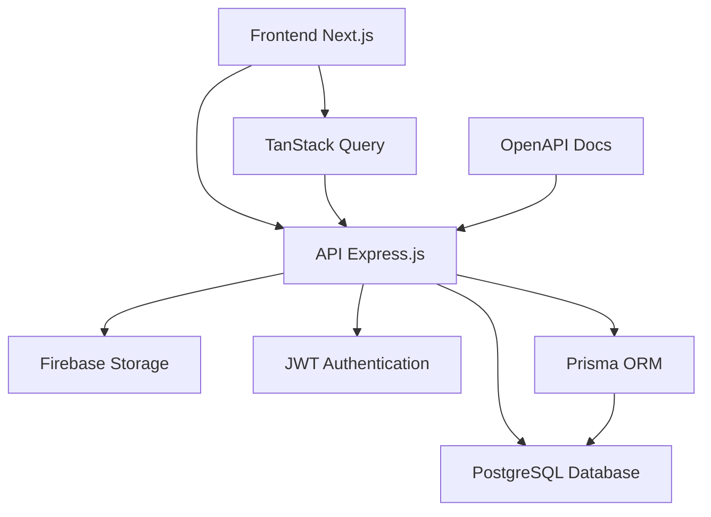

# 🌐 RedeCT - Rede de Ciência e Tecnologia

<div align="center">


**Uma rede independente que conecta pesquisadores, povos tradicionais e a academia**

[](https://nextjs.org/)
[](https://www.typescriptlang.org/)
[](https://reactjs.org/)
[](https://nodejs.org/)
[](https://www.postgresql.org/)
[](https://www.prisma.io/)
[](https://tailwindcss.com/)
[](https://firebase.google.com/)

[](CONTRIBUTING.md)
[](https://github.com/seu-usuario/rede-ct/issues)

</div>

## 📋 Índice

- [🎯 Sobre o Projeto](#-sobre-o-projeto)
- [🚀 Funcionalidades](#-funcionalidades)
- [🛠 Tecnologias](#-tecnologias)
- [🏗 Arquitetura](#-arquitetura)
- [🚀 Instalação](#-instalação)
- [⚙️ Configuração](#️-configuração)
- [🎮 Uso](#-uso)
- [📄 Licença](#-licença)

## 🎯 Sobre o Projeto

A **RedeCT** é uma rede independente que reúne pesquisadores, professores, estudantes, povos tradicionais e demais interessados que atuam acadêmica e cientificamente em colaboração com os Povos Tradicionais (indígenas, quilombolas, caiçaras, ribeirinhos, povos de terreiro, faxinalenses, geraizeiros, pantaneiros, quebradeiras de coco babaçu, dentre outros).

### 🎯 Missão

Contribuir para a melhoria contínua das produções científicas e das relações entre a academia e os povos tradicionais, promovendo a convergência entre conhecimento acadêmico e saberes tradicionais.

### 🌟 Principais Características

- **🌍 Rede Internacional**: Conecta pesquisadores de diversos países
- **🤝 Colaboração Acadêmica**: Promove parcerias entre universidades e comunidades tradicionais
- **📚 Publicações Científicas**: Mantém coletâneas anuais de trabalhos científicos
- **🎪 Eventos Científicos**: Organiza congressos e webinários permanentes
- **👥 Gestão de Equipes**: Sistema completo de gestão de equipes de pesquisa
- **🏆 Certificações**: Controle de certificados e pendências
- **📊 Dashboard Administrativo**: Painel completo para gestão da rede
- **🔐 Sistema de Autenticação**: Controle de acesso seguro

## 🚀 Funcionalidades

### 🌐 Área Pública
- **🏠 Homepage**: Apresentação da RedeCT com timeline histórica interativa
- **👥 Quem Somos**: História, missão, valores e objetivos da rede
- **💼 Portfólio**: Projetos e iniciativas da rede com galeria de imagens
- **📰 Notícias**: Sistema completo de notícias e atualizações
- **📚 Publicações**: Livros, artigos e revistas parceiras
- **📅 Eventos**: Calendário de eventos científicos com filtros
- **🔬 Pesquisadores**: Diretório completo de pesquisadores participantes
- **📊 Estatísticas**: Dados e métricas da rede

### 🔐 Área Restrita (Admin)
- **👤 Gestão de Usuários**: Cadastro, edição e controle de usuários
- **📝 Gestão de Notícias**: Criação, edição e publicação de notícias
- **👥 Gestão de Equipes**: Administração completa de equipes de pesquisa
- **🏆 Certificados**: Controle de certificações e documentos
- **⏳ Pendências**: Gestão de pendências e documentos
- **📈 Histórico de Contribuições**: Acompanhamento detalhado de contribuições
- **⚙️ Perfil do Usuário**: Gerenciamento completo de perfil pessoal
- **📊 Dashboard**: Painel administrativo com métricas e relatórios

### 👥 Gestão de Equipes
- **🎯 Equipe de Gestão**: Administração da equipe principal
- **⚖️ Comitê Legitimador**: Gestão do comitê de legitimação
- **🌱 Equipe SDHC**: Gestão da equipe de sustentabilidade
- **🔬 Grupos de Pesquisa**: Administração de grupos de pesquisa
- **📋 Membros**: Gestão de membros e suas funções
- **📊 Relatórios**: Geração de relatórios de equipes

## 🛠 Tecnologias

### 🎨 Frontend
| Tecnologia | Versão | Descrição |
|------------|--------|-----------|
| **Next.js** | 15.5.4 | Framework React com App Router e Server Components |
| **React** | 19.1.1 | Biblioteca de interface de usuário |
| **TypeScript** | 5.0+ | Tipagem estática para JavaScript |
| **Tailwind CSS** | 4.1.13 | Framework de CSS utilitário |
| **Radix UI** | 1.4.3 | Componentes acessíveis e customizáveis |
| **React Hook Form** | 7.62.0 | Gerenciamento de formulários performático |
| **TanStack Query** | 5.80.7 | Gerenciamento de estado do servidor |
| **TanStack Table** | 8.21.3 | Tabelas avançadas e interativas |
| **Lucide React** | 0.515.0 | Biblioteca de ícones |
| **Motion** | 12.23.12 | Animações e transições |
| **Zod** | 4.1.8 | Validação de schemas |

### ⚙️ Backend
| Tecnologia | Versão | Descrição |
|------------|--------|-----------|
| **Node.js** | 18+ | Runtime JavaScript |
| **Express.js** | 5.1.0 | Framework web minimalista |
| **TypeScript** | 5.8.3 | Tipagem estática |
| **Prisma** | 6.9.0 | ORM moderno para banco de dados |
| **PostgreSQL** | 14+ | Banco de dados relacional |
| **JWT** | 9.0.2 | Autenticação baseada em tokens |
| **Bcrypt** | 3.0.2 | Criptografia de senhas |
| **Multer** | 2.0.0 | Upload de arquivos |
| **Firebase Admin** | 13.4.0 | Armazenamento de arquivos |
| **CORS** | 2.8.5 | Cross-Origin Resource Sharing |

### 🔧 DevOps & Ferramentas
| Tecnologia | Descrição |
|------------|-----------|
| **Docker** | Containerização da aplicação |
| **Vercel** | Deploy automático do frontend |
| **Biome** | Linter e formatter moderno |
| **OpenAPI/Swagger** | Documentação interativa da API |
| **Prisma Studio** | Interface visual para o banco |
| **TSUP** | Bundler rápido para TypeScript |

## 🏗 Arquitetura

O projeto segue uma arquitetura de **monorepo** com duas aplicações principais:

```
rede-ct/
├── rede-ct/                    # Frontend (Next.js)
│   ├── src/
│   │   ├── app/                # App Router (Next.js 13+)
│   │   │   ├── (public)/       # Rotas públicas
│   │   │   └── (protected)/    # Rotas protegidas
│   │   ├── components/         # Componentes reutilizáveis
│   │   │   ├── ui/             # Componentes base
│   │   │   └── icons/          # Ícones customizados
│   │   ├── hooks/              # Custom hooks
│   │   ├── http/               # Cliente HTTP e API calls
│   │   ├── utils/              # Utilitários
│   │   └── @types/             # Definições de tipos
│   └── public/                 # Assets estáticos
└── ws-rede-ct/                 # Backend (Express.js)
    ├── src/
    │   ├── controllers/        # Controladores da API
    │   ├── services/           # Lógica de negócio
    │   ├── repositories/       # Camada de acesso a dados
    │   ├── routes/             # Definição de rotas
    │   ├── middlewares/        # Middlewares customizados
    │   ├── dto/                # Data Transfer Objects
    │   └── openapi/            # Documentação da API
    └── prisma/                 # Schema e migrações do banco
```

### 🔄 Fluxo de Dados



## 🚀 Instalação

### 📋 Pré-requisitos

| Requisito | Versão | Descrição |
|-----------|--------|-----------|
| **Node.js** | 18+ | Runtime JavaScript |
| **npm** | 9+ | Gerenciador de pacotes |
| **Git** | 2.30+ | Controle de versão |

### 🔧 Instalação Passo a Passo

#### 1. Clone o repositório

```bash
git clone https://github.com/seu-usuario/rede-ct.git
cd rede-ct
```

#### 2. Instale as dependências

```bash
# Frontend
cd rede-ct
npm install
```

#### 3. Configure as variáveis de ambiente

```bash
# Copie o arquivo de exemplo
cp .env.example .env.local
```

#### 4. Inicie o servidor de desenvolvimento

```bash
# Frontend
cd rede-ct
npm run dev
```

## ⚙️ Configuração

### 🔐 Variáveis de Ambiente

#### Frontend (`rede-ct/.env.local`)
```env
# URLs da aplicação
NEXT_PUBLIC_API_URL=http://localhost:3001
NEXT_PUBLIC_APP_URL=http://localhost:3000
```


## 🎮 Uso

### 🚀 Desenvolvimento

```bash
# Frontend
cd rede-ct
npm run dev
```

### 🏭 Produção

```bash
# Build
cd rede-ct
npm run build

# Start
npm start
```

<div align="center">

**Desenvolvido com ❤️ para a Rede de Ciência e Tecnologia**

[](https://nextjs.org/)
[](https://www.typescriptlang.org/)
[](https://www.prisma.io/)

</div>